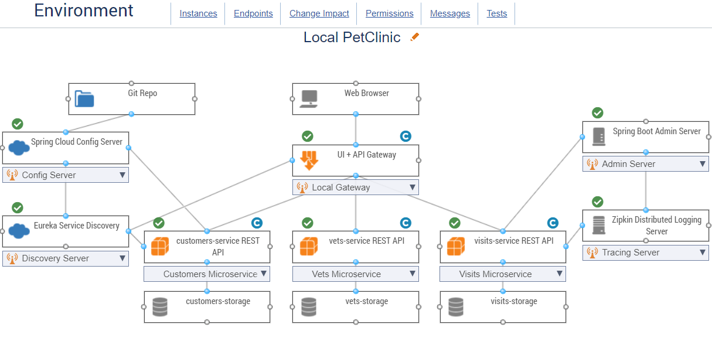

# Distributed version of the Spring PetClinic Sample Application built with Spring Cloud 

[](https://github.com/spring-petclinic/spring-petclinic-microservices/actions/workflows/maven-build.yml)
[](https://opensource.org/licenses/Apache-2.0)

This microservices branch was initially derived from [AngularJS version](https://github.com/spring-petclinic/spring-petclinic-angular1) to demonstrate how to split sample Spring application into [microservices](http://www.martinfowler.com/articles/microservices.html).
To achieve that goal, we use Spring Cloud Gateway, Spring Cloud Circuit Breaker, Spring Cloud Config, Micrometer Tracing, Resilience4j, Open Telemetry 
and the Eureka Service Discovery from the [Spring Cloud Netflix](https://github.com/spring-cloud/spring-cloud-netflix) technology stack.

## Prerequisites

To use this repo with Parasoft CTP and DTP integration you need:

- **Docker Desktop** — for building images and running the application stack
- **Java 17** and **Maven** — for building and running tests
- **Parasoft Jtest Maven plugin** — installed in your local Maven installation. See [Integrating with Maven](https://docs.parasoft.com/display/JTEST20261/Integrating+with+Maven) for setup instructions.
- **Parasoft CTP** — running and accessible; must have a Spring PetClinic environment configured with coverage-agent connections for the four instrumented services. Import `ctp-system.zip` from this repo to set up the environment quickly.
- **Parasoft DTP** — running and accessible; must have a project named `spring-petclinic-microservices` (or update `dtp.project` in [`jtest.settings`](jtest.settings) and [`jtest/coverage/agent.properties`](jtest/coverage/agent.properties))
- **Parasoft Jtest license** — accessible via your Parasoft License Server

## Key Configuration Files

| File | Purpose | Edit before running? |
|---|---|---|
| [`jtest.settings`](jtest.settings) | Jtest license and DTP connection | **Yes** — fill in the six blank credential fields |
| [`jtest/coverage/agent.properties`](jtest/coverage/agent.properties) | Coverage agent template for all four services | **Yes** — set `ctp.websocket.url` to the address the agents inside containers use to reach CTP (e.g. `ws://ctp:8080/em/coverage/websocket` if CTP runs in a container named `ctp` on the same Docker network). The setup script patches `ctp.subscription.queue` and `dtp.*` values automatically. |
| [`scripts/setup-coverage.sh`](scripts/setup-coverage.sh) / [`setup-coverage.ps1`](scripts/setup-coverage.ps1) | Generates per-service `agent.properties` from CTP/DTP and creates runtime data directories. Pass `--extract-jars` / `-ExtractJars` to also extract agent jars (only needed for `spring-boot:run`). | Run once after cloning (see Step 3 below) |
| [`docker-compose-cc.yml`](docker-compose-cc.yml) | Docker Compose for coverage-enabled deployments; supports `single` and `lb` profiles | No editing needed |

## Local Deployment with Coverage

The following steps assume CTP and DTP are already running. The four instrumented services are:
`spring-petclinic-api-gateway`, `spring-petclinic-customers-service`, `spring-petclinic-vets-service`, `spring-petclinic-visits-service`.

### Step 1 — Configure `jtest.settings`

Edit [`jtest.settings`](jtest.settings) and fill in the six blank fields:

```properties
license.network.url=https://your-license-server
license.network.user=your-username
license.network.password=your-password

dtp.url=https://your-dtp-server
dtp.user=your-username
dtp.password=your-password
```

The remaining values (`dtp.project`, `build.id`, `report.coverage.images`) already match the project defaults.

### Step 2 — Publish static coverage to DTP

Before running functional tests, publish a static coverage baseline to DTP. This also creates the DTP project and filter that the setup script (Step 3) needs to look up — so this step must run first on a fresh DTP deployment.

```bash
mvn -ntp clean install jtest:monitor \
    -DskipTests=true \
    -Djtest.settings=jtest.settings \
    -Djtest.showSettings=true \
    -Dproperty.report.dtp.publish=true
```

This uses [`jtest.settings`](jtest.settings) and must be run after Step 1. It only needs to be re-run when the application source code changes between test runs.

### Step 3 — Run the coverage setup script

The setup script resolves CTP subscription queues and DTP filter IDs from the CTP/DTP APIs, writes a per-service `agent.properties` under each service's `src/test/resources/coverage/` directory, and creates the runtime data directories that Docker Compose bind-mounts into containers. Agent jar extraction is **skipped by default** — the Dockerfile bakes them into the image. Pass `--extract-jars` / `-ExtractJars` only for the `spring-boot:run` path.

**Linux / macOS:**
```bash
export PARASOFT_USER=your-ctp-user
export PARASOFT_PASS=your-ctp-password
./scripts/setup-coverage.sh \
    --ctp-url http://your-ctp:8080 \
    --env-id <CTP environment ID> \
    --dtp-url http://your-dtp:8083
```

**Windows (PowerShell):**
```powershell
$env:PARASOFT_USER = "your-ctp-user"
$env:PARASOFT_PASS = "your-ctp-password"
.\scripts\setup-coverage.ps1 `
    -CtpUrl http://your-ctp:8080 `
    -EnvId <CTP environment ID> `
    -DtpUrl http://your-dtp:8083
```

**All options:**

| Bash flag | PowerShell flag | Default | Description |
|---|---|---|---|
| `--ctp-url` | `-CtpUrl` | _(required)_ | CTP base URL, e.g. `http://ctp:8080` |
| `--env-id` | `-EnvId` | _(required)_ | CTP environment ID (visible in environment settings) |
| `--dtp-url` | `-DtpUrl` | _(required)_ | DTP base URL, e.g. `https://dtp:8443` |
| `--build-id` | `-BuildId` | `baseline` | Appended to app name to form `dtp.buildID` |
| `--app-name` | `-AppName` | `spring-petclinic-microservices` | DTP project / image prefix |
| `--extract-jars` | `-ExtractJars` | off | Extract agent jars from the CTP Docker image — use only for the `spring-boot:run` path |
| `--use-ctp-ws-url` | `-UseCTPWsUrl` | off | Set `ctp.websocket.url` from the CTP API response instead of the template value; use when CTP is on a remote host |
| `--ci-debug` | `-CiDebug` | off | Print extra debug output |

> **Custom build ID** — Pass `--build-id` / `-BuildId` to track multiple builds in DTP independently. The value is appended to the app name to form `dtp.buildID` in each `agent.properties` (e.g. `spring-petclinic-microservices-sprint-42`):
> ```bash
> ./scripts/setup-coverage.sh --ctp-url ... --env-id ... --dtp-url ... --build-id sprint-42
> ```
> ```powershell
> .\scripts\setup-coverage.ps1 -CtpUrl ... -EnvId ... -DtpUrl ... -BuildId sprint-42
> ```

> **Remote CTP** — If CTP is not reachable as `ctp` on the Docker network (e.g. Jenkins or an external host), add `--use-ctp-ws-url` so `ctp.websocket.url` is written from the CTP API response rather than the template default:
> ```bash
> ./scripts/setup-coverage.sh --ctp-url ... --env-id ... --dtp-url ... --use-ctp-ws-url
> ```
> ```powershell
> .\scripts\setup-coverage.ps1 -CtpUrl ... -EnvId ... -DtpUrl ... -UseCTPWsUrl
> ```

> **`spring-boot:run` path** — Add `--extract-jars` / `-ExtractJars` to copy agent jars into each service's `src/test/resources/coverage/` directory for the Maven `coverage` profile. You can fill in `ctp.subscription.queue` manually using the pattern hint in `jtest/coverage/agent.properties` if you prefer not to call the script at all:
> ```bash
> ./scripts/setup-coverage.sh --extract-jars --ctp-url ... --env-id ... --dtp-url ...
> ```
> ```powershell
> .\scripts\setup-coverage.ps1 -ExtractJars -CtpUrl ... -EnvId ... -DtpUrl ...
> ```

### Step 4 — Build Docker images

```bash
./mvnw clean install -P buildDocker -DskipTests=true
```

Agent jars are pulled from `parasoft/ctp:latest` during the image build automatically — no separate download needed. Pass `--extract-jars` in Step 3 only if you plan to run services via `mvnw spring-boot:run`.

### Step 5 — Start the services

**Single-instance** (one container per service — default for most local use):
```bash
docker-compose -f docker-compose-cc.yml --profile single up -d
```

**Load-balanced** (two containers per service behind nginx):
```bash
docker-compose -f docker-compose-cc.yml --profile lb up -d
```

The application is available at `http://localhost:8099` once the API gateway is ready (allow ~3 minutes for all services to register with Eureka).

### Step 6 — Run the functional tests

See [Web functional tests integrated with CTP](#web-functional-tests-integrated-with-ctp) for links to each test module's README.

## Jenkins Pipeline

The `jobs/` directory contains three pipelines that automate all of the above for CI environments. No manual file editing is needed when running via Jenkins — CTP/DTP URLs and credentials are Jenkins parameters and credentials.

| File | Purpose |
|---|---|
| [`Jenkinsfile`](jobs/Jenkinsfile) | Main CI pipeline: build, static analysis, unit tests, deploy, functional tests, publish CTP baseline |
| [`Jenkinsfile.deploy`](jobs/Jenkinsfile.deploy) | Deployment pipeline: runs `setup-coverage.sh`, builds Docker images, launches the service stack |
| [`Jenkinsfile.tia`](jobs/Jenkinsfile.tia) | TIA pipeline: builds, deploys, and runs only tests impacted by recent code changes |

### Jenkins Server Prerequisites

#### Credentials

One credential entry is required in **Manage Jenkins → Credentials**:

| ID | Type | Description |
|---|---|---|
| `parasoft-demo-user` | Username with password | Parasoft username and password used for CTP API calls, DTP publishing, and the Jtest license server |

#### Global Environment Variables

One global environment variable is required in **Manage Jenkins → Configure System → Global properties → Environment variables**:

| Variable | Description |
|---|---|
| `DEFAULT_LSS_URL` | Parasoft License Server URL (e.g. `https://your-license-server`) |

#### Tool Configurations

The following tools must be configured in **Manage Jenkins → Tools**:

| Tool | Name used in pipeline |
|---|---|
| Maven | `maven` |
| JDK 17 | `JDK 17` |

#### Agent Requirements

The Jenkins agent that executes the pipelines must have:

- **Docker** — installed and accessible to the `jenkins` user; the `demo-net` Docker network must exist (`docker network create demo-net`)
- **AWS EC2** — the agent must run on an EC2 instance; the pipelines resolve the instance's private IP from the EC2 metadata service
- **`jq`** — installed on the agent (`sudo yum install jq` or equivalent)

#### Pipeline Job Names

The pipelines reference each other by job name. The three jobs must be named exactly:

| Job name | Pipeline file |
|---|---|
| `Petclinic-baseline` | `Jenkinsfile` |
| `Petclinic-deploy` | `Jenkinsfile.deploy` |
| `Petclinic-tia` | `Jenkinsfile.tia` |

`Petclinic-baseline` triggers `Petclinic-deploy` and is referenced by `Petclinic-tia` to look up the last successful baseline build ID.

#### Script Approval (TIA pipeline only)

`Jenkinsfile.tia` uses `Jenkins.instance.getItemByFullName(...)` to look up the last successful `Petclinic-baseline` build. This requires a one-time approval in **Manage Jenkins → In-process Script Approval** after the first run.

#### Pipeline Parameters

Each pipeline exposes its required inputs (CTP URL, DTP URL, environment name, build ID) as run-time parameters visible in the Jenkins UI. Default values are pre-configured in each `Jenkinsfile`; no pre-configuration on the server is needed for parameters.

## Starting services locally without Docker

Every microservice is a Spring Boot application and can be started locally using IDE ([Lombok](https://projectlombok.org/) plugin has to be set up) or `../mvnw spring-boot:run` command. Please note that supporting services (Config and Discovery Server) must be started before any other application (Customers, Vets, Visits and API).
Startup of Tracing server, Admin server, Grafana and Prometheus is optional.
If everything goes well, you can access the following services at given location:
* Discovery Server - http://localhost:8761
* Config Server - http://localhost:8888
* AngularJS frontend (API Gateway) - http://localhost:8080
* Customers, Vets and Visits Services - random port, check Eureka Dashboard 
* Tracing Server (Zipkin) - http://localhost:9411/zipkin/ (we use [openzipkin](https://github.com/openzipkin/zipkin/tree/master/zipkin-server))
* Admin Server (Spring Boot Admin) - http://localhost:9090
* Grafana Dashboards - http://localhost:3000
* Prometheus - http://localhost:9091

You can tell Config Server to use your local Git repository by using `native` Spring profile and setting
`GIT_REPO` environment variable, for example:
`-Dspring.profiles.active=native -DGIT_REPO=/projects/spring-petclinic-microservices-config`

## Starting services locally with docker-compose
In order to start entire infrastructure using Docker, you have to build images by executing `./mvnw clean install -P buildDocker` 
from a project root. Once images are ready, you can start them with a single command
`docker-compose up`. Containers startup order is coordinated with [`dockerize` script](https://github.com/jwilder/dockerize). 
After starting services, it takes a while for API Gateway to be in sync with service registry,
so don't be scared of initial Spring Cloud Gateway timeouts. You can track services availability using Eureka dashboard
available by default at http://localhost:8761.

The `master` branch uses an Eclipse Temurin with Java 17 as Docker base image.

*NOTE: Under MacOSX or Windows, make sure that the Docker VM has enough memory to run the microservices. The default settings
are usually not enough and make the `docker-compose up` painfully slow.*


## Starting services locally with docker-compose and Java
If you experience issues with running the system via docker-compose you can try running the `./scripts/run_all.sh` script that will start the infrastructure services via docker-compose and all the Java based applications via standard `nohup java -jar ...` command. The logs will be available under `${ROOT}/target/nameoftheapp.log`. 

Each of the java based applications is started with the `chaos-monkey` profile in order to interact with Spring Boot Chaos Monkey. You can check out the (README)[scripts/chaos/README.md] for more information about how to use the `./scripts/chaos/call_chaos.sh` helper script to enable assaults.

## Understanding the Spring Petclinic application

[See the presentation of the Spring Petclinic Framework version](http://fr.slideshare.net/AntoineRey/spring-framework-petclinic-sample-application)

[A blog post introducing the Spring Petclinic Microsevices](http://javaetmoi.com/2018/10/architecture-microservices-avec-spring-cloud/) (french language)

You can then access petclinic here: http://localhost:8080/


**Architecture diagram of the Spring Petclinic Microservices**


**CTP environment diagram of the Spring Petclinic Microservices**



Import `ctp-system.zip` from this Git repo into your CTP to quickly set up the above diagram.

## Web functional tests integrated with CTP

Several test modules are included for running web functional tests that report test results and coverage data to Parasoft CTP. Each module has its own README with detailed usage instructions:

* [`spring-petclinic-selenium-tests`](spring-petclinic-selenium-tests/) — Selenium with JUnit 5
* [`spring-petclinic-selenium-junit4-tests`](spring-petclinic-selenium-junit4-tests/) — Selenium with JUnit 4
* [`spring-petclinic-selenium-cucumber-tests`](spring-petclinic-selenium-cucumber-tests/) — Selenium with Cucumber and JUnit 5
* [`spring-petclinic-selenium-testng-tests`](spring-petclinic-selenium-testng-tests/) — Selenium with TestNG
* [`spring-petclinic-playwright-tests`](spring-petclinic-playwright-tests/) — Playwright with JUnit 5

Each module uses the `coverage-integration` library (`com.parasoft:coverage-integration-*`) for Parasoft CTP session management, baggage header injection, and test result reporting. See each module's README for configuration details.


## In case you find a bug/suggested improvement for Spring Petclinic Microservices

Our issue tracker is available here: https://github.com/spring-petclinic/spring-petclinic-microservices/issues

## Database configuration

In its default configuration, Petclinic uses an in-memory database (HSQLDB) which gets populated at startup with data.
A similar setup is provided for MySql in case a persistent database configuration is needed.
Dependency for Connector/J, the MySQL JDBC driver is already included in the `pom.xml` files.

### Start a MySql database

You may start a MySql database with docker:

```
docker run -e MYSQL_ROOT_PASSWORD=petclinic -e MYSQL_DATABASE=petclinic -p 3306:3306 mysql:5.7.8
```
or download and install the MySQL database (e.g., MySQL Community Server 5.7 GA), which can be found here: https://dev.mysql.com/downloads/

### Use the Spring 'mysql' profile

To use a MySQL database, you have to start 3 microservices (`visits-service`, `customers-service` and `vets-services`)
with the `mysql` Spring profile. Add the `--spring.profiles.active=mysql` as programm argument.

By default, at startup, database schema will be created and data will be populated.
You may also manually create the PetClinic database and data by executing the `"db/mysql/{schema,data}.sql"` scripts of each 3 microservices. 
In the `application.yml` of the [Configuration repository], set the `initialization-mode` to `never`.

If you are running the microservices with Docker, you have to add the `mysql` profile into the (Dockerfile)[docker/Dockerfile]:
```
ENV SPRING_PROFILES_ACTIVE docker,mysql
```
In the `mysql section` of the `application.yml` from the [Configuration repository], you have to change 
the host and port of your MySQL JDBC connection string. 

## Custom metrics monitoring

Grafana and Prometheus are included in the `docker-compose.yml` configuration, and the public facing applications
have been instrumented with [MicroMeter](https://micrometer.io) to collect JVM and custom business metrics.

A JMeter load testing script is available to stress the application and generate metrics: [petclinic_test_plan.jmx](spring-petclinic-api-gateway/src/test/jmeter/petclinic_test_plan.jmx)


### Using Prometheus

* Prometheus can be accessed from your local machine at http://localhost:9091

### Using Grafana with Prometheus

* An anonymous access and a Prometheus datasource are setup.
* A `Spring Petclinic Metrics` Dashboard is available at the URL http://localhost:3000/d/69JXeR0iw/spring-petclinic-metrics.
You will find the JSON configuration file here: [docker/grafana/dashboards/grafana-petclinic-dashboard.json]().
* You may create your own dashboard or import the [Micrometer/SpringBoot dashboard](https://grafana.com/dashboards/4701) via the Import Dashboard menu item.
The id for this dashboard is `4701`.

### Custom metrics
Spring Boot registers a lot number of core metrics: JVM, CPU, Tomcat, Logback... 
The Spring Boot auto-configuration enables the instrumentation of requests handled by Spring MVC.
All those three REST controllers `OwnerResource`, `PetResource` and `VisitResource` have been instrumented by the `@Timed` Micrometer annotation at class level.

* `customers-service` application has the following custom metrics enabled:
  * @Timed: `petclinic.owner`
  * @Timed: `petclinic.pet`
* `visits-service` application has the following custom metrics enabled:
  * @Timed: `petclinic.visit`

## Looking for something in particular?

| Spring Cloud components         | Resources  |
|---------------------------------|------------|
| Configuration server            | [Config server properties](spring-petclinic-config-server/src/main/resources/application.yml) and [Configuration repository] |
| Service Discovery               | [Eureka server](spring-petclinic-discovery-server) and [Service discovery client](spring-petclinic-vets-service/src/main/java/org/springframework/samples/petclinic/vets/VetsServiceApplication.java) |
| API Gateway                     | [Spring Cloud Gateway starter](spring-petclinic-api-gateway/pom.xml) and [Routing configuration](/spring-petclinic-api-gateway/src/main/resources/application.yml) |
| Docker Compose                  | [Spring Boot with Docker guide](https://spring.io/guides/gs/spring-boot-docker/) and [docker-compose file](docker-compose.yml) |
| Circuit Breaker                 | [Resilience4j fallback method](spring-petclinic-api-gateway/src/main/java/org/springframework/samples/petclinic/api/boundary/web/ApiGatewayController.java)  |
| Grafana / Prometheus Monitoring | [Micrometer implementation](https://micrometer.io/), [Spring Boot Actuator Production Ready Metrics] |

 Front-end module  | Files |
|-------------------|-------|
| Node and NPM      | [The frontend-maven-plugin plugin downloads/installs Node and NPM locally then runs Bower and Gulp](spring-petclinic-ui/pom.xml)  |
| Bower             | [JavaScript libraries are defined by the manifest file bower.json](spring-petclinic-ui/bower.json)  |
| Gulp              | [Tasks automated by Gulp: minify CSS and JS, generate CSS from LESS, copy other static resources](spring-petclinic-ui/gulpfile.js)  |
| Angular JS        | [app.js, controllers and templates](spring-petclinic-ui/src/scripts/)  |


## Interesting Spring Petclinic forks

The Spring Petclinic `main` branch in the main [spring-projects](https://github.com/spring-projects/spring-petclinic)
GitHub org is the "canonical" implementation, currently based on Spring Boot and Thymeleaf.

This [spring-petclinic-microservices](https://github.com/spring-petclinic/spring-petclinic-microservices/) project is one of the [several forks](https://spring-petclinic.github.io/docs/forks.html) 
hosted in a special GitHub org: [spring-petclinic](https://github.com/spring-petclinic).
If you have a special interest in a different technology stack
that could be used to implement the Pet Clinic then please join the community there.


# Contributing

The [issue tracker](https://github.com/spring-petclinic/spring-petclinic-microservices/issues) is the preferred channel for bug reports, features requests and submitting pull requests.

For pull requests, editor preferences are available in the [editor config](.editorconfig) for easy use in common text editors. Read more and download plugins at <http://editorconfig.org>.


[Configuration repository]: https://github.com/spring-petclinic/spring-petclinic-microservices-config
[Spring Boot Actuator Production Ready Metrics]: https://docs.spring.io/spring-boot/docs/current/reference/html/production-ready-metrics.html


